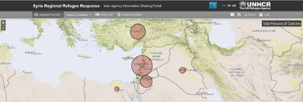
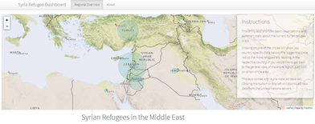

## Overview

The `Syria Refugee Dashboard` is a re-engineered version of the [Syria Regional Refugee Response Portal](http://data.unhcr.org/syrianrefugees/regional.php) originally provided by the UN Refugee Agency (UNHCR) based on [R](http://www.r-project.org/), [Shiny](http://http://shiny.rstudio.com/), and [Leaflet](http://leafletjs.com/).


Original UN web application:




Re-engineered Shiny app:



--- .class #id 

## Benefits & Features

* __Increased perception__ : Covers an important world topic from a data perspective
* __Up-to-date R technology__: Uses a bunch of packages from the 'Hadleyverse' (`dplyr`, `tidyr`, `ggplot2`) and other modern libraries like `jsonlite` and `leaflet`
* __Most current data__: Refreshes the data any time you want by leveraging the United Nations JSON API
* __Visualizes demographic data__: Provides a light-weight ggplot2-based pyramid plot which can be re-used in other projects
* __Easily extendible:__ Although overall country data is accessible via the UI, all backend functionality to retrieve regional data is already implemented

---

## One feature in more detail

* The pyramid plot was implemented using ggplot2 and is part of `utils.R`
* It can easily be modified for re-use in other projects
* The basic idea was two plot to different bar plots at the same time (Don't run example below)


```r
demographic_data <- demographic_data %>% filter(name == country_name)  
y_max <- max(demographic_data$percent) %>% round_any(10, f = ceiling)

g <- ggplot(demographic_data, aes(age, percent, fill = gender)) +
geom_bar(data = filter(demographic_data, gender == 'M'), stat = 'identity')) +
geom_bar(aes(y = percent * -1), filter(demographic_data, gender == 'F'),
stat = 'identity') +
coord_flip() +
scale_y_continuous(breaks = seq(y_max * -1, y_max, 10),
labels = abs(seq(y_max * -1, y_max, 10)),
limits = c((y_max * -1) - 1, y_max + 1))
```

---

## Outlook and issues

### What can be done in the future?

* A later version of the `Syria Refugee Dashboard` might include country-specific maps to show regional/federal state-specific refugee data

### What are the current issues?

* Joe Cheng's `leaflet` package lacks documenation and was very hard to use the first time
* The current data retrieval process does not include exception handling: Currently, the app relies on the fact that the United Nations severs are up 24/7  


